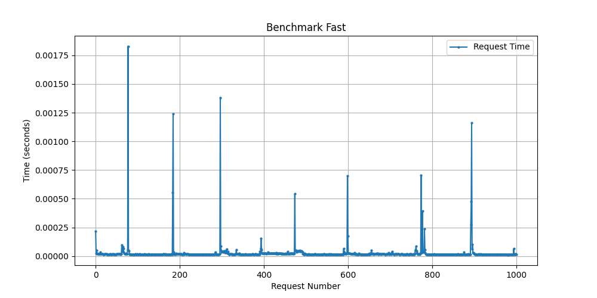
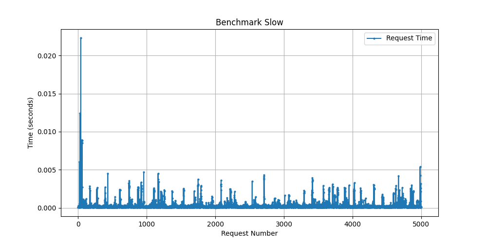
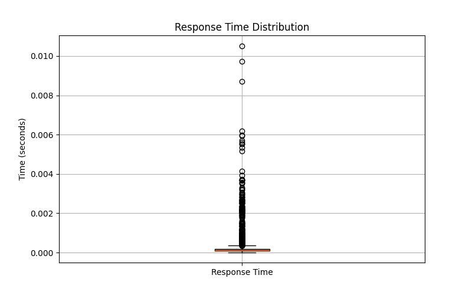

# Project Overview
This project consists of a high-performance server and client implementation in C++, along with extensive benchmarking using Python. The benchmarks generate various performance graphs, including box plots and pie charts.

---

## Project Structure
```
├── benchmark
│   ├── bench_box_plot.py      # Script to generate box plot from benchmark data
│   ├── benchmark_fast.py      # Fast execution benchmark
│   └── benchmark_slow.py      # Slow execution benchmark
├── benchmark_fast_results.png # Image of fast benchmark results
├── benchmark_slow_results.png # Image of slow benchmark results
├── docker-compose.yml         # Docker Compose configuration
├── Dockerfile                 # Dockerfile to containerize the project
├── extensive_benchmark_results.png # Image of extensive benchmark results
├── Makefile                   # Makefile for building the project
├── README.md                  # This README file
├── requirements.txt            # Python dependencies
├── response_time_boxplot.png   # Image of response time distribution (Box plot)
├── response_time_piechart.png  # Image of response time distribution (Pie chart)
├── src
│   ├── client.cc               # Client implementation
│   ├── command.cc, command.h   # Command processing logic
│   ├── conn.h                  # Connection handling
│   ├── epoll_manager.cc, epoll_manager.h # Epoll-based event management
│   ├── server.cc, server.h     # Server implementation
│   └── utils.h                 # Utility functions
└── test
    └── test.py                 # Python test script for validation
```

---

## Running the Project

### 1️⃣ Running with Docker
#### **Build the Docker Image**
```sh
docker build -t my_server .
```

#### **Run the Server**
```sh
docker run -p 6969:6969 --name server_container my_server
```

#### **Run the Client**
```sh
docker run --network host my_server ./client
```

---

### 2️⃣ Running Benchmarks
#### **Setup a Python Virtual Environment**
```sh
python -m venv venv
source venv/bin/activate  # On Windows use `venv\Scripts\activate`
```

#### **Install Dependencies**
```sh
pip install -r requirements.txt
```

#### **Run Benchmark Scripts**
```sh
python benchmark/benchmark_fast.py
python benchmark/benchmark_slow.py
python benchmark/bench_box_plot.py
```

#### **Benchmark Results**
## For Fast Benchmark
```
Total Requests: 1000
Successful Requests: 1000
Total Time: 0.028688 sec
Average Time per Request: 0.000029 sec
```

## For Slow Benchmark
```
Total Requests: 5000
Successful Requests: 5000
Total Time: 1.049078 sec
Average Time per Request: 0.000210 sec
Median Time per Request: 0.000118 sec
Max Time per Request: 0.010576 sec
Min Time per Request: 0.000015 sec
```

#### **Generated Benchmark Results**
Below are the benchmark images generated:
- **Fast Benchmark:**
  
- **Slow Benchmark:**
  
- **Response Time Box Plot:**
  

---

### 3️⃣ Running Tests
#### **Run the Python Test Suite**
```sh
python test/test.py
```

---

### 4️⃣ Running Locally (Without Docker)
#### **Build the Project**
```sh
make
```

#### **Run the Server**
```sh
./server
```

#### **Run the Client**
```sh
./client
```

#### **Clean the Build**
```sh
make clean
```

---

## Notes
- Ensure that the server is running before executing the client or benchmark scripts.
- The benchmarks will generate performance graphs to analyze the efficiency of the server.
- Docker is recommended for an isolated and reproducible environment.

🚀 Happy Coding!
